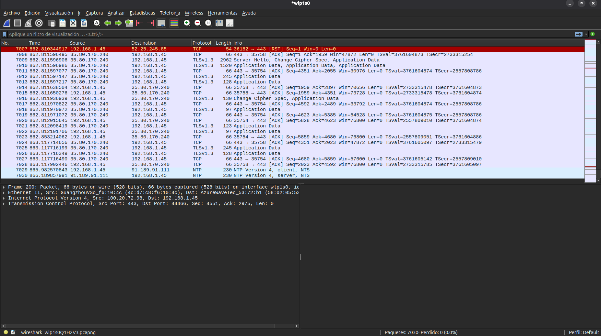
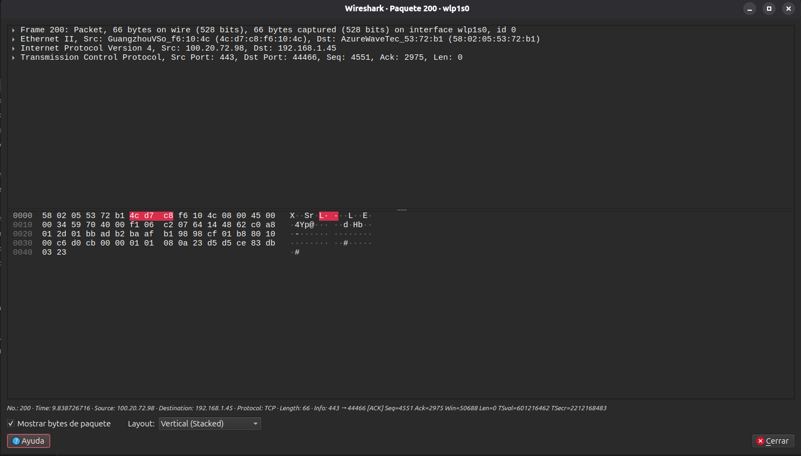
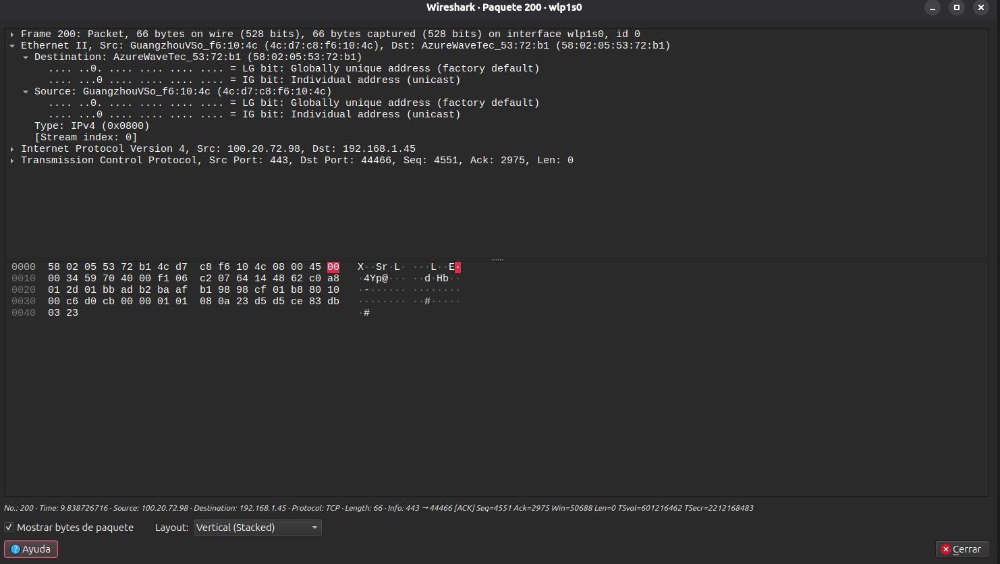
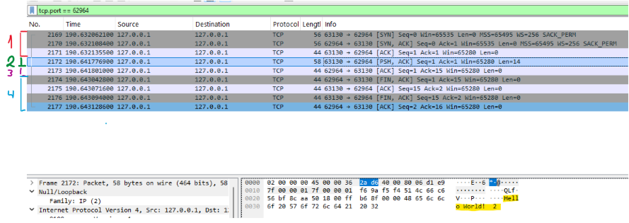
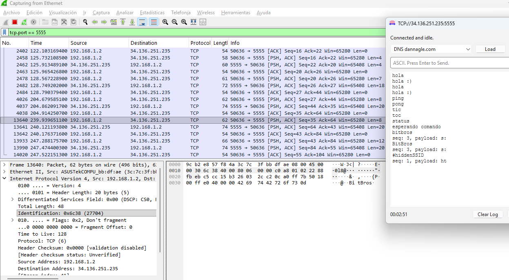

# TP3-de-Comunicaciones-de-Datos

### 1.a

La capa de Enlace de Datos o capa 2 del modelo OSI, se encarga de la comunicación entre dispositivos conectados directamente en el mismo segmento de red local. Resuelve problemas como: direccionamiento físico (MAC), detección de errores de transmisión, control de acceso al medio compartido, y el empaquetado de bits en tramas para que la capa de Red pueda operar sobre ellas.

### 1.b

MAC: dirección física de 48 bits, asignada por el fabricante a la interfaz de red (NIC). Es de capa 2, no tiene jerarquía, es decir, no indica dónde está el dispositivo en la red y solo tiene sentido dentro del mismo segmento local.
IP: dirección lógica de capa 3, asignada por configuración o DHCP (permite enrutamiento entre redes) y puede cambiar.

La diferencia clave: la MAC identifica el dispositivo físico dentro de la LAN; la IP identifica al dispositivo dentro de toda la red/Internet y permite que los routers decidan por dónde encaminar el tráfico.

### 1.c

Una trama Ethernet es la unidad básica de transmisión de datos en la capa de enlace, usada en redes Ethernet. Es la estructura con la que se empaqueta la información antes de enviarla físicamente por el medio como cable o aire. Se podria decir que es el sobre que usa la capa de enlace para mover datos entre dos dispositivos dentro del mismo segmento de red local.

Preámbulo + SFD: sincronización del receptor con el emisor.
MAC destino (6 bytes): a quién va dirigida la trama.
MAC origen (6 bytes): quién la envía.
EtherType (2 bytes): indica qué protocolo de capa superior viene encapsulado.
Datos/Payload (46–1500 bytes): el contenido real (típicamente un paquete IP).
FCS (4 bytes): checksum CRC para detectar errores en la transmisión.

### 1.d

La informacion es otorgada por el campo Ethernet. Algunos valores comunes o ejemplos de dicha informacion son: 0x0800 = IPv4, 0x0806 = ARP, 0x86DD = IPv6.

## 2

### Wireshark

### Trama de Ethernet

### 2.a 

La IP destino 192.168.1.45 es una IP privada de nuestra red local, así que este paquete está entrando hacia nuestra compu. La MAC destino (de fabricante `AzureWaveTec`) es la placa Wi-Fi de la propia notebook. Y la MAC origen (de fabricante `GuangzhouVSo`) es la del router de la red local, no la del servidor con el que nos estamos comunicando. O sea, la MAC que vemos ahí es solo la del último "cartero" que trajo el paquete, no la del que lo mandó originalmente.

### 2.b

El origen es `100.20.72.98` es una IP pública, del servidor real al que nos conectamos (tráfico cifrado de una web segura).
El destino es `192.168.1.45` nuestra propia IP dentro de la red local.

### 2.c

No representa lo mismo por que la IP indica quiénes son los dos extremos reales de la comunicación (el servidor en internet y nuestra compu) y se mantiene igual durante todo el recorrido del paquete. La MAC, en cambio, solo identifica el tramo local, es decir, acá vemos la MAC del router y la de la notebook, nunca la del servidor real, porque va cambiando en cada salto de la red hasta llegar a destino.

### 2.d

El campo Type dentro de "Ethernet II" muestra el valor 0x0800, que corresponde a IPv4. Este campo es justamente el que le indica al receptor que el contenido encapsulado en la trama es un paquete IPv4, lo cual coincide con lo observado en la sección "Internet Protocol Version 4" de la misma trama.

## 3

### 3.a

Ethernet e IP hacen lo mínimo: entregan paquetes "a ciegas", sin garantías. TCP se encarga de todo lo que le falta a esa entrega para que sea confiable. Ethernet resuelve la entrega dentro de la LAN, IP resuelve el enrutamiento entre redes, pero ninguno de los dos garantiza que los datos lleguen completos, en orden, sin duplicarse y a la aplicación (proceso) correcta dentro del host. Esto es lo que agrega TCP.

### 3.b

La cabecera TCP tiene bastantes más campos que la de UDP porque se encarga de mucho más:

- **Puerto de origen / destino**: identifican qué proceso envía y qué proceso recibe en cada extremo.
- **Número de secuencia**: numera los datos enviados para poder reordenarlos y detectar faltantes en destino.
- **Número de ACK**: indica cuál es el próximo byte que se espera recibir, confirmando que lo anterior llegó bien.
- **Longitud de cabecera**: indica cuánto ocupa la cabecera, ya que puede variar por el campo Opciones.
- **Reservado**: bits sin uso.
- **Flags (SYN, ACK, FIN, RST, PSH, URG)**: controlan el estado de la conexión (abrir, confirmar, cerrar, cortar, entregar ya, marcar urgente).
- **Ventana**: cuántos bytes más puede recibir el otro extremo sin confirmar todavía. Es el control de flujo.
- **Suma de verificación**: permite detectar si el segmento se corrompió en el camino.
- **Puntero urgente**: solo se usa si está el flag URG, marca hasta dónde llegan los datos urgentes.
- **Opciones y relleno**: parámetros extra opcionales, con relleno para que la cabecera quede alineada.

UDP en cambio solo tiene puerto de origen, puerto de destino, largo del segmento y checksum. No numera, no confirma, no reordena ni controla flujo, por eso es mucho más liviano pero no confiable por sí solo.

### 3.c

**Three-way handshake (apertura de la conexión):**
1. El cliente envía un segmento con el flag SYN, proponiendo un número de secuencia inicial.
2. El servidor responde con SYN + ACK, aceptando la conexión y proponiendo su propio número de secuencia inicial.
3. El cliente responde con ACK, confirmando. A partir de acá la conexión queda establecida y ambos lados pueden enviar datos.

**Four-way handshake (cierre de la conexión):**
1. El extremo que quiere cerrar envía un segmento con el flag FIN.
2. El otro extremo responde con ACK, confirmando que recibió el aviso (pero puede seguir enviando datos si todavía le quedan).
3. Cuando ese extremo también termina, envía su propio FIN.
4. El primero responde con ACK, confirmando el cierre. Recién ahí se libera la conexión de los dos lados.

Se necesitan cuatro pasos (y no tres como al abrir) porque el cierre es independiente en cada sentido: cada extremo puede terminar de enviar en un momento distinto, entonces cada uno manda su propio FIN cuando ya no tiene más datos para enviar.

### 3.d y e

En la imagen vemos 4 apartados
    - 1 El cliente y el servidor se saludan previamente intercambiando tres paquetes de control (SYN, SYN-ACK, ACK) para sincronizarse, asegurar que ambos están activos y abrir el canal.
    - 2 Una vez abierto el túnel, el emisor despacha el paquete que contiene la información real, marcado con la bandera de empuje (PSH).
    -3 El receptor devuelve instantáneamente un paquete de confirmación (ACK) para validar que el mensaje llegó completo y sin errores. 
    -4 Four-way handshake: Al terminar la comunicación, ambas máquinas ejecutan un proceso formal de cuatro pasos (intercambiando banderas FIN y ACK) para desconectarse ordenadamente y liberar la memoria, evitando dejar puertos colgados

### 3.f 
La infraestructura de red transporta mensajes como se los mandan, esto implica que es necesario una capa mas de proteccion o cifrado que impida el acceso libre a alguien que este conectado al mismo medio.

### 4

Se probaron los comandos base con el servidor: `hola` → `hola :)`, `ping` → `pong`, `tic` → `toc`, `status` → `esperando comando`. Al enviar el comando del grupo, `bitbros`, el servidor respondió con varios paquetes de payload (`seq: 3, payload: BitBros`, `seq: 3, payload: #hiddenSSID`, entre otros), confirmando el reconocimiento del grupo.