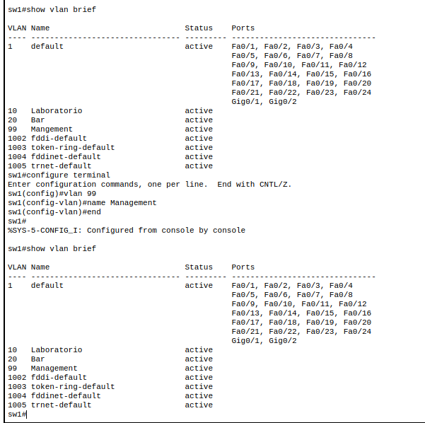
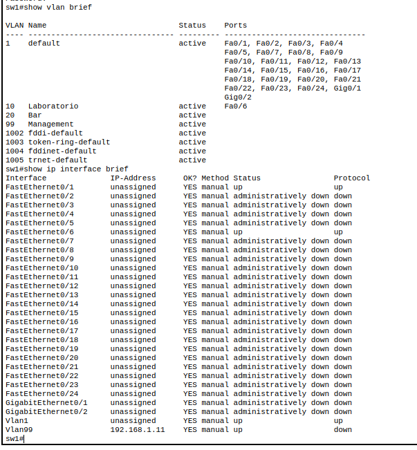
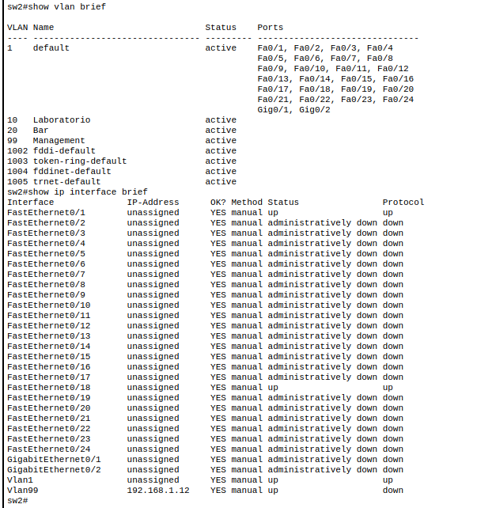
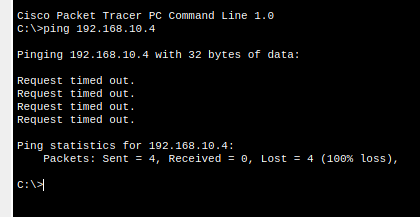
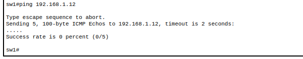

# TP4-de-Comunicaciones-de-Datos

## 1) Alcance de Redes y Virtualización

### 1.a

Las redes se clasifican según su alcance geográfico en:

- **PAN (Personal Area Network):** cobertura de pocos metros, conecta dispositivos personales de un mismo usuario (Bluetooth, USB, NFC, infrarrojo).
- **LAN (Local Area Network):** cobertura de un edificio u oficina, administrada por una sola organización, alta velocidad y bajo costo (Ethernet, Wi-Fi local).
- **CAN (Campus Area Network):** interconexión de varias LAN dentro de un campus universitario o corporativo, sin salir del predio.
- **MAN (Metropolitan Area Network):** cobertura de una ciudad, interconecta varias LAN/CAN de distintos puntos de la misma.
- **WAN (Wide Area Network):** cobertura de grandes distancias (países, continentes), generalmente usa enlaces de terceros/ISP (Internet es la WAN más grande).

*(Falta completar en la Figura del enunciado el acrónimo que corresponde a cada recuadro con estas clasificaciones)*

### 1.b

Una **VLAN (Virtual Local Area Network)** es una segmentación lógica de una red física, que agrupa dispositivos en un mismo dominio de broadcast independientemente de su ubicación física o del switch al que estén conectados, como si fuera una LAN separada. Esto permite dividir una red físicamente única en varias redes lógicas aisladas entre sí (por ejemplo, separar tráfico de invitados, administración, distintas áreas de una empresa, etc.) sin necesidad de cablear switches distintos para cada una.

Se pueden clasificar según el criterio de asignación de los puertos a la VLAN:

- **Por puerto (Port-based):** la más común, cada puerto del switch se asigna manualmente a una VLAN.
- **Por dirección MAC:** el switch asigna la VLAN según la MAC del dispositivo conectado, sin importar el puerto físico.
- **Por protocolo:** la VLAN se asigna según el protocolo de capa 3 que use el tráfico (IP, IPX, etc.).
- **Por subred/dirección IP:** se agrupa según el rango de IP del dispositivo.
- **Dinámica:** asignada automáticamente mediante un servidor (VMPS) según reglas predefinidas.

Además, según su función suele hablarse de VLAN de datos, VLAN de voz, VLAN nativa (la que no lleva etiqueta en un trunk) y VLAN de administración/management (como la VLAN 99 que configuramos en el punto 2).

### 1.c

El **IEEE 802.1Q** es el estándar que define el *trunking* o etiquetado de VLANs sobre Ethernet. Especifica cómo insertar una etiqueta (tag) de 4 bytes dentro de la trama Ethernet, ubicada entre la dirección MAC origen y el campo EtherType/Length original. Esta etiqueta contiene:

- **TPID (Tag Protocol Identifier):** 2 bytes, valor fijo 0x8100 que indica que la trama está etiquetada según 802.1Q.
- **TCI (Tag Control Information):** 2 bytes, que incluyen:
  - **PCP (Priority Code Point):** 3 bits, prioridad de la trama (QoS).
  - **DEI/CFI:** 1 bit, indica si puede descartarse en caso de congestión.
  - **VLAN ID:** 12 bits, identifica la VLAN (0 a 4095, permite hasta 4094 VLANs utilizables).

Gracias a esta etiqueta, un mismo enlace físico (un puerto en modo *trunk*) puede transportar el tráfico de múltiples VLANs simultáneamente, porque cada trama queda marcada con la VLAN a la que pertenece y el switch del otro extremo sabe a qué dominio de broadcast reenviarla.

### 1.d

El **Tagging** es el proceso de agregar (o leer) la etiqueta 802.1Q en una trama Ethernet para identificar a qué VLAN pertenece cuando circula por un enlace troncal (trunk) compartido por varias VLANs. Las tramas etiquetadas se llaman *tagged*, mientras que las que no llevan la marca (como las que entran/salen por un puerto en modo *access*) se llaman *untagged*, y el switch las asocia automáticamente a la VLAN configurada en ese puerto (o a la VLAN nativa, en el caso de un trunk). En definitiva, el tagging es el mecanismo concreto por el cual funciona 802.1Q: sin él, un trunk no podría distinguir a qué VLAN pertenece cada trama que transporta.

### 2.i

La VLAN 1, llamada default. Es la VLAN a la que pertenecen automáticamente todos los puertos de un switch Cisco recién configurado, hasta que se les asigna explícitamente otra VLAN. Por eso vemos que todos los puertos (activos e inactivos) siguen listados bajo la VLAN 1, incluso los que después vamos a mover a las VLANs 10, 20 o 99.

### 2.l

**show ip interface brief (sw1):**

La interfaz Vlan1 quedó sin dirección IP asignada (unassigned) tras el comando `no ip address`, 
aunque se mantiene en estado up/up porque sigue siendo la VLAN nativa del switch. 
La interfaz Vlan99 muestra el estado **up/down**: el "up" indica que la interfaz está 
administrativamente habilitada (no shutdown), pero el "down" del protocolo de línea indica 
que aún no hay ningún puerto físico activo perteneciente a la VLAN 99.

### 2.n

**Ping PC-A a PC-B (192.168.10.4):**

**Ping sw1 a sw2 (192.168.1.12):**

Los dos pings fallan por la misma razón. Cuando movimos los puertos F0/6 y F0/18 a la VLAN 10, 
y las IPs de gestión a la VLAN 99, ese tráfico quedó encerrado dentro de cada switch por 
separado. El cable que conecta sw1 con sw2 (puerto F0/1 en los dos) sigue siendo un puerto 
de acceso normal en la VLAN 1, nunca lo configuramos para que sea un enlace troncal (trunk).

Un puerto de acceso solo deja pasar el tráfico de una sola VLAN. Entonces, aunque PC-A y PC-B 
estén las dos en la VLAN 10, o las direcciones de management de ambos switches estén en la 
VLAN 99, ese tráfico no tiene por dónde cruzar de un switch al otro: el único cable que los 
une solo transporta la VLAN 1.

Esto muestra en la práctica para qué sirve el protocolo 802.1Q que vimos en el punto 1c, para 
que un solo cable entre switches pueda llevar el tráfico de varias VLANs a la vez, hace falta 
configurarlo como trunk, que es lo que permite "etiquetar" cada trama para que el otro switch 
sepa a qué VLAN pertenece.

Como el enunciado no pedía configurar ese enlace como trunk, este resultado (que el ping falle) 
es justamente lo esperado.

## 3) Simulación de red LAN a bordo de una aeronave (VLAN + NAT + ACL)

*(Pendiente: topología con router del avión, servidor de entretenimiento, NAT para Business, ACL bloqueando Internet a Turista, y pruebas de la tabla)*
